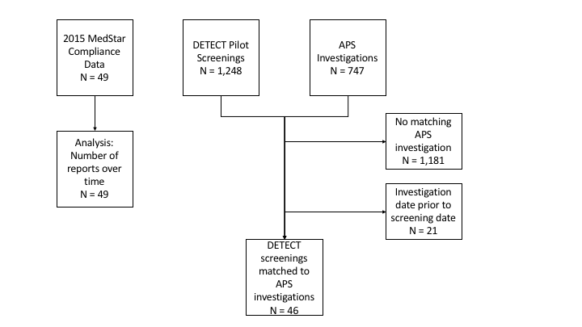

# Detection of Elder Abuse Through Emergency Care Technicians (DETECT) 5-Week Pilot Study

## Background

Detection of Elder Abuse Through Emergency Care Technicians (DETECT) is a U.S. National Institute of Justice funded project designed to help first responders – especially EMTs and paramedics – identify potential cases of elder abuse and neglect in the community. This repository outlines the methods we used to evaluate that pilot test.

## Methods

The pilot test took place from September 17th, 2015 to October 26th, 2015 in Tarrant County (Fort Worth) Texas. All medics (EMTs and paramedics) completed the screening tool when they responded to a call for a community-dwelling patient who was 65 years of age or older, and medics were instructed to contact APS based on screening tool results. Frequency of change in medic reporting was evaluated, along with the predictive performance of the individual screening items.

_Flow diagram illustrating which data sources were used for each analysis, and how final sample sizes were derived._

## Results

MedStar successfully integrated the DETECT screening questions into its ePCR and pilot-tested the DETECT screening tool for over a month. During that time, the screening tool was used 1,248 times by 97% of the medics who responded to a qualified 911 call. Medics selected a “yes” response to at least one screening item on 209 out of the completed screenings (16.8%). Immediately following the introduction of the DETECT screening tool, there was an increase of 3.6 (152% above baseline) validated reports per month (p < 0.0001).

## Conclusions

EMS providers encounter older adults who are living with EA. Identification of EA cases by medics is facilitated by incorporation of the DETECT tool into the ePCR and may enhance medics’ efforts for early detection of EA in community dwelling older adults.

# DETECT pilot data

Deidentified data collected during the DETECT pilot study are available from [NACJD](https://www.icpsr.umich.edu/icpsrweb/content/NACJD/index.html).

# Data cleaning and analysis codes

For more information about our analysis process and results, please click in the individual code file of interest below:

## Data cleaning code

[Process used to clean data from MedStar](https://rawgit.com/brad-cannell/detect_pilot_test/master/markdown/data_01_clean_medstar.nb.html)

* Data from MedStar that contains all uses of the DETECT screening tool

* Data from MedStar that includes demographic and health information for all patients who where age >= 65 and treated during the pilot period

[Process used to clean the APS Investigations data](https://rawgit.com/brad-cannell/detect_pilot_test/master/markdown/data_02_clean_aps.nb.html)

* Client information

* [Abuse/Neglect Allegations](http://www.dfps.state.tx.us/handbooks/APS/Files/APS_pg_1340.asp#APS_1340)

* [Investigation dispositions](http://www.dfps.state.tx.us/handbooks/APS/Files/APS_pg_2700.asp#APS_2700)

* [Investigation closure reasons](http://www.dfps.state.tx.us/handbooks/APS/Files/APS_pg_2800.asp#APS_2900)

[Process used to Link records in the cleaned MedStar data with records in the cleaned APS data](https://rawgit.com/brad-cannell/detect_pilot_test/master/markdown/data_03_merge_medstar_aps.nb.html)

[Processed used to preprocess merged data for analysis](https://rawgit.com/brad-cannell/detect_pilot_test/master/markdown/data_04_preprocess_merged_for_analysis.nb.html)

* Variable manipulation and recode missing.

* Save deidentified versions of data    

## Analysis code

[Analysis of all known MedStar reports to APS in 2015](https://rawgit.com/brad-cannell/detect_pilot_test/master/markdown/analysis_medstar_reports_to_aps_2015.nb.html)

[Demographic characteristics of the sample of older adults who were screened by MedStar using the DETECT tool during the phase 1 pilot test](https://rawgit.com/brad-cannell/detect_pilot_test/master/markdown/analysis_describe_screened_patients.nb.html)

[Characteristics of the APS investigations that we were able to link to DETECT screenings](https://rawgit.com/brad-cannell/detect_pilot_test/master/markdown/analysis_characteristics_of_investigations.nb.html)

[Analysis of the individual screening tool items]()

[Feasibility analysis]()

# Codebooks

[MedStar Screening Data (medstar\_nid)]()

[DETECT Pilot Test Data (detect\_p)]()

# APS Handbook

For details about the APS outcome variables (e.g., allegations, dispositions, etc.) please refer to the [APS Handbook](http://www.dfps.state.tx.us/handbooks/APS/).

# Funding Acknowledgement

This project was supported by Award No. 2014-MU-CX-0102, awarded by the National Institute of Justice, Office of Justice Programs, U.S. Department of Justice. The opinions, findings, and conclusions or recommendations expressed in this publication/ program/exhibition are those of the author(s) and do not necessarily reflect those of the Department of Justice.
