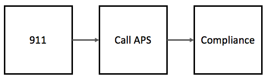

# Overview

In this file, we do quick cleaning and an analysis of the APS reporting data we received from MedStar's legal compliance department. Specifically, the input data set is called:

* APS Report Data_UNTHSC_IRB.xlsx

Figure 1, below, illustrates MedStar’s current standard operating procedure for reporting suspected elder abuse and neglect. In the first step, the medic responds to a 911 call. He or she must use their experience and subjective judgement alone to determine if they believe elder abuse or neglect may be occurring. If they suspect elder abuse is occurring, they are required by [Texas law](https://www.txabusehotline.org/Login/Default.aspx), and MedStar’s standard operating procedure, to report the suspected abuse to [Texas’ statewide intake](https://www.dfps.state.tx.us/Contact_Us/report_abuse.asp). They can make this report over the phone, or using an online web form. Finally, if the medic reports suspected elder abuse or neglect to APS, the procedure is for them to let the MedStar legal compliance department know that the report was made. Of course, at each of these steps there is the potential for a breakdown in the process.

During the pilot study, all MedStar medics were given access to the pilot version of the DETECT screening tool through their Electronic Patient Care Reporting system (ePCR). In this analysis, we investigate all reports to APS in 2015 that were reported to the MedStar legal compliance department. We are primarily interested evaluating whether or not reports increased during the period of time that the pilot test occurred.

**Figure 1.** Current medic reporting procedure.   




# Table of contents

1. [Import and clean the DETECT reporting data](#data)     
2. [Exploratory data analysis](#eda)   
3. [DETECT pilot response id's](#detect-ids)   
4. [Tables and Figures](#tables-figures)   
5. [Summary](#summary)    
6. [Save deidentified data](#save)

```{r setup, include=FALSE}
knitr::opts_chunk$set(comment = NA)
Sys.setenv(TZ = "US/Central")
```

```{r load_packages, message=FALSE}
library(tidyverse)
library(readxl)
library(lubridate)
library(bfuncs)
```


-------------------------------------------------------------------------------

# Import and clean the DETECT reporting data {#data}

-------------------------------------------------------------------------------

```{r}
col_info <- c( 
# "col_name",     "col_type"
  "agency",       "text",
  "confim_num",   "text",
  "created",      "date",
  "reported",     "date",
  "electronic",   "text",
  "phone",        "text",
  "response_num", "text")

# Import data
medstar_aps <- read_excel(
  path = "/Users/bradcannell/Desktop/APS Report Data_UNTHSC_IRB.xlsx",
  sheet = "owssvr",
  col_names = col_info[seq(1, length(col_info), 2)],
  col_types = col_info[seq(2, length(col_info), 2)],
  skip = 1) %>% 
  arrange(reported)

about_data(medstar_aps) # 137 observations and 7 variables in the data
```


## Remove all the CPS cases

```{r}
medstar_aps <- filter(medstar_aps, agency == "APS")
about_data(medstar_aps) # 93 observations and 7 variables in the data 
```


## Remove 2016 cases

```{r}
medstar_aps <- filter(medstar_aps, reported <= as.POSIXct("2016-01-01"))
about_data(medstar_aps) # 49 observations and 7 variables in the data
```


## Identify DETECT pilot period

```{r}
start <- as.POSIXct("2015-09-17")
end   <- as.POSIXct("2015-10-26")

medstar_aps <- medstar_aps %>%
  mutate(
    detect_pilot = (reported >= start & reported <= end)
  )
```

At this point, the medstar_aps data contains 49 observations and 7 variables. All remaining reports were made to APS during the 2015 calendar year.

[top](#top)


-------------------------------------------------------------------------------

# Exploratory data analysis {#eda}

-------------------------------------------------------------------------------

```{r}
# medstar_aps_deidentified <- feather::read_feather("../data/medstar_aps_deidentified.feather")
```


## Calculate time difference

Here we calculate the difference in days between the variables reported (to APS) and created (recorded with MedStar compliance).

```{r}
medstar_aps <- medstar_aps %>%
  mutate(
    report_interval = interval(reported, created),
    interval_days   = report_interval / ddays()
  )
```


## Mean

Mean and maximum number of days between the report to APS and a record of that report appearing in the MedStar compliance data:

```{r mean_max}
medstar_aps %>% 
  summarise(
    `Mean Days` = mean(interval_days) %>% round(1), # 3.5
    `Max Days`  = max(interval_days) %>% round() # 22
  )
```


## Number of reports during DETECT pilot

```{r}
medstar_aps %>% 
  filter(detect_pilot == TRUE) %>% 
  count()
```


## Group by day and count number of reports

```{r}
medstar_reports_by_day <- medstar_aps %>% 
  group_by(reported) %>% 
  count() %>% 
  print()
```


## Group by month and count number of reports

```{r rows.print=12}
medstar_reports_by_month <- medstar_aps %>% 
  mutate(month = format(reported, "%m")) %>% 
  group_by(month) %>%
  count() %>%
  
  # Add January
  ungroup() %>% 
  add_row(month = "01", n = 0) %>%
  arrange(month) %>% 
  
  # Add month names
  mutate(
    month = ordered(
      month,
      labels = c("January", "February", "March", "April", "May", "June", 
      "July", "August", "September", "October", "November", "December")
    )
  ) %>% 
  print()
```


## Min and max report months

```{r}
medstar_reports_by_month %>% 
  summarise(
    `Min Reports`       = min(n), # 0
    `Min Reports Month` = month[n == `Min Reports`], # January
    `Max Reports`       = max(n), # 13
    `Max Reports Month` = month[n == `Max Reports`] # October
  )
```


## Distribution of reporting mode (phone / electronic / both)

```{r}
medstar_aps %>% 
  summarise(
    `Phone Only`      = sum(phone == "Yes" & electronic == "No"), # 33
    `Electronic Only` = sum(phone == "No" & electronic == "Yes"), # 12
    `Both`            = sum(phone == "Yes" & electronic == "Yes") # 4
  )
```

[top](#top)


-------------------------------------------------------------------------------

# DETECT pilot response id's {#detect-ids}

-------------------------------------------------------------------------------

These are the response id numbers that correspond to 911 responses where a report was made to APS during the DETECT pilot phase, and MedStar compliance was made aware of the report.

```{r response_id}
response_ids <- medstar_aps %>% 
  filter(reported >= start & reported <= end) %>% 
  select(response_num)

nrow(response_ids) # 14
```

There were 14 response id's with a report date between 2015-09-17 and 2015-10-26 in the data from MedStar compliance.


## Save response id's

We will look for these response id's in the DETECT screening data as well.

```{r}
feather::write_feather(response_ids, "/Users/bradcannell/Desktop/response_ids.feather")
```

[top](#top)


-------------------------------------------------------------------------------

# Tables and Figures {#tables-figures}

-------------------------------------------------------------------------------


## Table 1. MedStar reports to APS by month

```{r rows.print=12}
medstar_reports_by_month %>% 
  rename(Month = month, `Number of Reports` = n)
```

### Count number of reports by day

```{r}
reports_date <- medstar_aps %>%
  group_by(reported) %>%
  count() %>%
  rename(count_date = n)
```

### Count number of reports by month

```{r}
reports_month <- medstar_aps %>% 
  mutate(month = format(reported, "%m")) %>%
  group_by(month) %>%
  count() %>% 
  rename(count_month = n) %>%
  ungroup() %>% 
  
  # Add January
  add_row(month = "01", count_month = 0) %>%
  arrange(month) %>%
  
  # Add month names
  mutate(month = ordered(month,
    labels = c("January", "February", "March", "April", "May", "June", 
      "July", "August", "September", "October", "November", "December"))) %>%
  
  # Add POSIXct variable corresponding to the middle of each month for merging
  # with the daily data
  mutate(
    reported = as.POSIXct(c("2015-01-15", "2015-02-15", "2015-03-15", 
      "2015-04-15", "2015-05-15", "2015-06-15", "2015-07-15", "2015-08-15", 
      "2015-09-15", "2015-10-15", "2015-11-15", "2015-12-15")),
    tag = 1
  )
```

### Merge reports_date and reports_month

```{r}
reports_merge <- reports_date %>%
  full_join(reports_month, by = "reported") %>% 
  arrange(reported) %>% 
  replace_na(list(count_date = 0))
```


### Grab rows with values for count_month - need for geom_line

```{r}
rows <- which(!is.na(reports_merge["count_month"]))
```

### Create breaks at each month for the x axis

```{r}
mnth_breaks <- reports_merge$reported[rows]
```


## Figure 2. MedStar reports to APS by month

```{r}
ggplot(reports_merge) +
  geom_rug(aes(x = reported), col = "blue") +
  geom_point(aes(x = reported, y = count_month)) +
  geom_line(aes(x = reported, y = count_month), data = reports_merge[rows,]) +
  geom_vline(
    xintercept = as.numeric(as.POSIXct("2015-09-17")),
    col = "red", alpha = 0.5, linetype = 2
  ) +
  geom_vline(
    xintercept = as.numeric(as.POSIXct("2015-10-27")),
    col = "red", alpha = 0.5, linetype = 2
  ) +
  scale_y_continuous("Number of Reports to APS") +
  scale_x_datetime("Month", breaks = mnth_breaks, labels = format(mnth_breaks, "%b")) +
  theme_classic() +
  theme(
    axis.title = element_text(size = 12),
    axis.text = element_text(size = 12)
  )

# Size for export: 1778*1000

# This will come back with the following warnings:
# Removed 43 rows containing missing values (geom_point).  
# This can be safely ignored. This is just because of all the days with NA for
# count_month, which are supposed to be NA.
```

1. The red dashed lines indicate the time period in which the DETECT screening tool was used in MedStar's EPCR.   

2. The blue rug plot shows the marginal distribution of individual reports to APS. 

```{r figure2_export, warning=FALSE, include=FALSE}
# This is the same figure as above. Some of the dimensions are changed so that it looks better when exported for inclusion in a document or slide show.

# Size for export: 1778*1000

# Grab rows with values for count_month - need for geom_line
rows <- which(!is.na(reports_merge["count_month"]))

# Create breaks at each month for the x axis
mnth_breaks <- reports_merge$reported[rows]

ggplot(reports_merge) +
  geom_rug(aes(x = reported), col = "blue", size = 1.5) +
  geom_point(aes(x = reported, y = count_month), size = 2.5) +
  geom_line(aes(x = reported, y = count_month), data = reports_merge[rows,], size = 1.5) +
  geom_vline(
    xintercept = as.numeric(as.POSIXct("2015-09-17")),
    col = "red", alpha = 0.5, linetype = 2, size = 1.5
  ) +
  geom_vline(
    xintercept = as.numeric(as.POSIXct("2015-10-27")),
    col = "red", alpha = 0.5, linetype = 2, size = 1.5
  ) +
  scale_y_continuous("Number of Reports to APS") +
  scale_x_datetime("Month", breaks = mnth_breaks, labels = format(mnth_breaks, "%b")) +
  theme_bw() +
  theme(
    axis.title = element_text(size = 24),
    axis.text = element_text(size = 20)
  )
# This will come back with the following warnings:
# Removed 43 rows containing missing values (geom_point).  
# This can be safely ignored. This is just because of all the days with NA for
# count_month, which are supposed to be NA.
```

[top](#top)


-------------------------------------------------------------------------------

# Summary {#summary}

-------------------------------------------------------------------------------

In 2015, there were 49 total reports to APS that MedStar's compliance office was made aware of (Table 1). On average, MedStar compliance was made aware of reports 3.5 days after they occurred; however, in some cases MedStar compliance was not informed of the report for 22 days.

The DETECT screening tool was used in MedStar's EPCR from 2015-09-17 to 2015-10-26. **During that time 14 reports were made to APS.** January had the lowest number of reports (0), and October had the highest number of reports (13). Of the 49 total reports, 33 were made by phone only, 12 were made electronically only, and 4 were made by phone and electronically.


## Limitations

The primary limitation here is that we are unable to determine if reports to APS increased generally, or if reports to APS remained constant, and only the proportion of reports that compliance was made aware of increased.


-------------------------------------------------------------------------------

# Save deidentified data {#save}

-------------------------------------------------------------------------------

## Remove identifiers

Remove identifiers from the APS reporting data we received from MedStar's legal compliance department so that it can be uploaded to [NACJD]( https://www.icpsr.umich.edu/icpsrweb/content/NACJD/index.html)

* As part of the process of protecting participant anonymity, we will remove the day from all dates.

```{r}
medstar_aps_deidentified <- medstar_aps %>%
  select(created, reported, electronic, phone, detect_pilot) %>% 
  mutate(
    created  = format(created, "%Y-%m"),
    reported = format(reported, "%Y-%m")
  )
```


## Save deidentified data

* Save one copy in feather format for me.

* Save a second copy in CSV format for NACJD.

```{r}
feather::write_feather(medstar_aps_deidentified, "../data/medstar_aps_deidentified.feather")
readr::write_csv(medstar_aps_deidentified, "../data/medstar_aps_deidentified.csv")
```

[top](#top)


```{r session_info, echo=FALSE}
sessionInfo()
```
