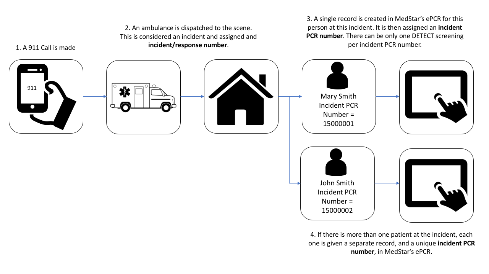

# Table of contents

* [Overview](#overview)   
* [Load packages and data](#load)   
* [Merge the screening data with the demographics and health data](#merge)   
* [Data checks](#checks)   
* [Save the merged MedStar datasets](#save)   


# Overview {#overview}

In this file we merge the MedStar DETECT screenings data with the MedStar demographics and health data to create a complete MedStar dataset.


## Key variable definitions 

It's important to understand the meaning of patient identification variables in the data sets, and the relationship between patient identification variables across both MedStar datasets. The following diagram shows how people are identified in the MedStar data:



In order to be consistent and reduce confusion, we will use the following terminology going forward:

```{r echo=FALSE, message=FALSE, warnings=FALSE, results='asis'}
tabl <- "
Variable             | Definition
---------------------|----------------------------------------------------------------|
Date entered         | The date that MedStar responded to the 911 call and filled out the DETECT screening tool |
Incident call number | The incident call number uniquely identifies the 911 incident (#2 in the diagram). In cases where there was more than one person screened at an incident, the incident call number is not unique to the person screened (#3 and #4 in the diagram). Therefore, multiple unique people may have the same incident call number. |
Incident PCR number  | The incident PCR number uniquely identifies the person screened at a given incident. NOTE: No two people should have the same incident PCR number; however, a single person may have multiple incident PCR numbers if they were treated by MedStar on multiple occasions (i.e., multiple incidents). |   
"
cat(tabl) # output the table in a format good for HTML/PDF/docx conversion
```


# Load packages and data {#load}

```{r setup, include=FALSE}
knitr::opts_chunk$set(comment = NA)
Sys.setenv(TZ = "US/Central")
```

```{r message=FALSE}
library(tidyverse)
library(bfuncs)
```


## MedStar DETECT screenings data

Created in data_medstar_detect_screenings_01_import.Rmd

```{r}
medstar_detect <- feather::read_feather("/Volumes/sph_research/Detect/medstar_detect.feather")
```

```{r}
about_data(medstar_detect) # 1,247 observations and 45 variable
```


## MedStar demographics and health data 

Created in data_medstar_health_01_import.Rmd

```{r}
medstar_health <- feather::read_feather("/Volumes/sph_research/Detect/medstar_health.feather")
```

```{r}
about_data(medstar_health) # 99,311 observations and 17 variables
```


# Merge the screening data with the demographics and health data {#merge}

The incident PCR number uniquely identifies the person screened at a given incident. Ideally, we would merge the two datasets based on this number. However, the DETECT screening items data did not come to us with incident PCR numbers. 

The incident call number uniquely identifies the 911 incident (#2 in the diagram). In cases where there was more than one person screened at an incident, the incident call number is not unique to the person screened (#3 and #4 in the diagram). Therefore, multiple unique people may have the same incident call number.

However, at any given incident there is unlikely to be two people with the same first name (we will check this). Therefore, we will merge the two datasets based on incident call number and first name.

## Check the no same first name at incident assumption

Results hidden to protect participant privacy

```{r eval=FALSE}
medstar_detect %>% 
  group_by(incident_call_number) %>% 
  filter(max(row_number()) > 1) %>% 
  select(incident_call_number, first_name, first_name_02, last_name)
```

```{r eval=FALSE}
medstar_health %>% 
  group_by(incident_call_number, first_name) %>% 
  filter(row_number() == 1) %>% 
  group_by(incident_call_number) %>% 
  filter(max(row_number()) > 1) %>%
  select(incident_call_number, incident_pcr_number, first_name, first_name_02, last_name)
```

After doing some manual data checks, at any given incident there are no two people with the same first name. Therefore, we will merge the two datasets based on incident call number and first name. 


## Merge data

```{r}
medstar_complete <- medstar_health %>% 
  left_join(medstar_detect, by = c("incident_call_number", "first_name"))
```

```{r}
about_data(medstar_complete) # 99,311 observations and 60 variables
```

[top](#top)


# Data checks {#checks}

## Make sure that all rows from the DETECT screening items data survived the join.

```{r}
medstar_complete %>% 
  filter(detect_data == 1) %>% 
  group_by(incident_pcr_number) %>% 
  filter(row_number() == 1) %>% 
  ungroup() %>% 
  nrow()
```

```{r}
medstar_complete %>%
  filter(detect_data == 1) %>% 
  group_by(incident_call_number, first_name) %>%
  filter(row_number() == 1) %>%
  ungroup() %>%
  summarise(`N combinations of incident and first name with DETECT screening` = sum(detect_data))
```


## Which variables have a dataset identifier?

```{r}
medstar_complete %>% 
  select(ends_with(".x"), ends_with(".y")) %>% 
  names() %>% 
  sort()
```


## Count the number of differences between variables that appear in both datasets.

```{r}
diff_vars <- quos(first_name_02.x, first_name_02.y, last_name.x, last_name.y, age.x, age.y)

medstar_complete %>% 
  
  # Make missing explicit for comparison
  mutate_at(
    vars(!!! diff_vars),
    tidyr::replace_na,
    "Missing"
  ) %>% 
  
  # Keep one row per incident pcr
  group_by(incident_pcr_number) %>% 
  filter(row_number() == 1) %>% 
  ungroup() %>% 
  
  # Count discrepancies
  summarise(
    `Different first_name_02 value` = sum(first_name_02.x != first_name_02.y),
    `Different last_name` = sum(last_name.x != last_name.y, na.rm = TRUE),
    `Different age` = sum(age.x != age.y, na.rm = TRUE)
  )
```


## Check first name 02 differences

Results hidden to protect participant privacy

```{r rows.print=15, eval=FALSE}
medstar_complete %>% 
  mutate(
    first_name_02.x = replace_na(first_name_02.x, "Missing"),
    first_name_02.y = replace_na(first_name_02.y, "Missing")
  ) %>% 
  filter(first_name_02.x != first_name_02.y) %>% 
  mutate(
    first_name_02.x = recode(first_name_02.x, "Missing" = NA_character_),
    first_name_02.y = recode(first_name_02.y, "Missing" = NA_character_)
  ) %>% 
  select(incident_pcr_number, full_name, starts_with("first_name"), starts_with("last_name")) %>% 
  group_by(incident_pcr_number) %>% 
  filter(row_number() == 1) %>% 
  ungroup() %>% 
  select(-incident_pcr_number)
```

.x = medstar_health   
.y = medstar_detect

There are some people in the Medstar demographics and health data that don't exist in the DETECT screening data. Those people are missing for first_name_02.y by definition.

In the DETECT screening data, I start with one name variable for full name. Whereever there was three part name, the code assumed the second part went with the first name (e.g., Mary Jo Smith). However, there were also some two part last names (e.g., Mary Johnson Smith).

Since there is an explicit first name variable in the demographics and health data, we will defer to the first name value from that dataset.

```{r}
medstar_complete <- medstar_complete %>% 
  select(-first_name_02.y) %>% 
  rename(first_name_02 = first_name_02.x)
```

```{r}
about_data(medstar_complete) # 99,311 observations and 59 variables
```


## Check last name differences

Results hidden to protect participant privacy

```{r eval=FALSE}
medstar_complete %>% 
  mutate(
    last_name.x = replace_na(last_name.x, "Missing"),
    last_name.y = replace_na(last_name.y, "Missing")
  ) %>% 
  filter(last_name.x != last_name.y) %>% 
  mutate(
    last_name.x = recode(last_name.x, "Missing" = NA_character_),
    last_name.y = recode(last_name.y, "Missing" = NA_character_)
  ) %>% 
  select(incident_pcr_number, full_name, starts_with("first_name"), starts_with("last_name")) %>% 
  group_by(incident_pcr_number) %>% 
  filter(row_number() == 1) %>% 
  ungroup() %>% 
  select(-incident_pcr_number)
```

.x = medstar_health   
.y = medstar_detect

There are some people in the Medstar demographics and health data that don't exist in the DETECT screening data. Those people are missing for last_name.y by definition.

Below we view differences among people who exist in both datasets (results hidden to protect participant privacy).

```{r eval=FALSE}
medstar_complete %>% 
  mutate(
    last_name.x = replace_na(last_name.x, "Missing"),
    last_name.y = replace_na(last_name.y, "Missing")
  ) %>% 
  filter(last_name.x != last_name.y) %>% 
  mutate(
    last_name.x = recode(last_name.x, "Missing" = NA_character_),
    last_name.y = recode(last_name.y, "Missing" = NA_character_)
  ) %>% 
  select(incident_pcr_number, full_name, starts_with("first_name"), starts_with("last_name")) %>% 
  group_by(incident_pcr_number) %>% 
  filter(row_number() == 1) %>% 
  ungroup() %>% 
  select(-incident_pcr_number) %>% 
  filter(!is.na(full_name))
```

In the DETECT screening data, I start with one name variable for full name. Whereever there was three part name, the code assumed the second part went with the first name (e.g., Mary Jo Smith). However, there were also some two part last names (e.g., Mary Johnson Smith).

Since there is an explicit last name variable in the demographics and health data, we will defer to the last name value from that dataset.

```{r}
medstar_complete <- medstar_complete %>% 
  select(-last_name.y) %>% 
  rename(last_name = last_name.x)
```

```{r}
about_data(medstar_complete) # 99,311 observations and 58 variables
```


## Different ages

Results hidden to protect participant privacy

```{r eval=FALSE}
medstar_complete %>% 
  mutate(
    age.x = replace_na(age.x, "Missing"),
    age.y = replace_na(age.y, "Missing")
  ) %>% 
  filter(age.x != age.y) %>% 
  mutate(
    age.x = recode(age.x, "Missing" = NA_character_),
    age.y = recode(age.y, "Missing" = NA_character_)
  ) %>% 
  select(incident_pcr_number, first_name, last_name, starts_with("age")) %>% 
  group_by(incident_pcr_number) %>% 
  filter(row_number() == 1) %>% 
  ungroup() %>% 
  select(-incident_pcr_number)
```

.x = medstar_health   
.y = medstar_detect

There are some people in the Medstar demographics and health data that don't exist in the DETECT screening data. Those people are missing for age.y by definition.

Below we view differences among people who exist in both datasets (results hidden to protect participant privacy).

```{r eval=FALSE}
medstar_complete %>% 
  mutate(
    age.x = replace_na(age.x, "Missing"),
    age.y = replace_na(age.y, "Missing")
  ) %>% 
  filter(age.x != age.y) %>% 
  mutate(
    age.x = recode(age.x, "Missing" = NA_character_),
    age.y = recode(age.y, "Missing" = NA_character_)
  ) %>% 
  select(incident_pcr_number, first_name, last_name, starts_with("age")) %>% 
  group_by(incident_pcr_number) %>% 
  filter(row_number() == 1) %>% 
  ungroup() %>% 
  select(-incident_pcr_number) %>% 
  filter(!is.na(age.y))
```

Most of these differences appear to be off by rounding errors. Because there are only small differences between the values of age.x and age.y and because every person has a value for age.x -- but not age.y -- we will keep age.x.

```{r}
medstar_complete <- medstar_complete %>% 
  select(-age.y) %>% 
  rename(age = age.x)
```

```{r}
about_data(medstar_complete) # 99,311 observations and 57 variables
```

The MedStar demographics and health data is now linked to the DETECT screening data. There are some instances when more than one person was screened at a given incident. However, each incident PCR number is linked to a unique screening - if one exists.

[top](#top)


# Save the merged MedStar datasets {#save}

```{r}
feather::write_feather(medstar_complete, "/Volumes/sph_research/Detect/medstar_complete.feather")
```

[top](#top)

&nbsp;

-------------------------------------------------------------------------------

```{r echo=FALSE}
sessionInfo()
```